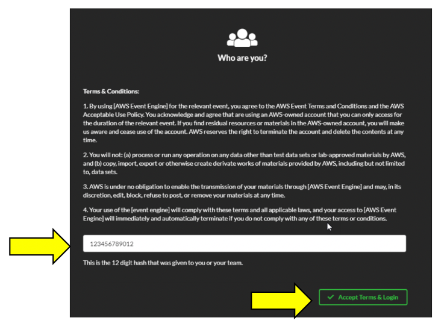
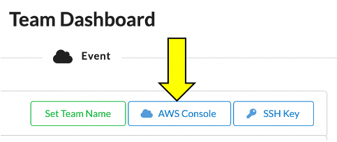
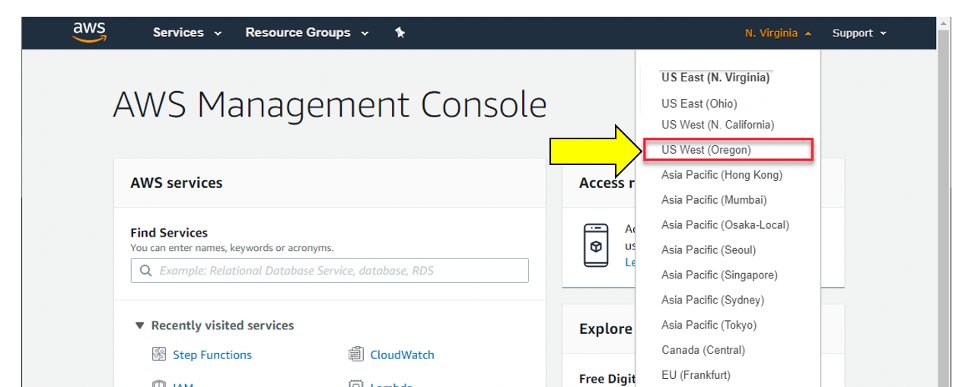

+++
title = "AWS Event Engine"
chapter = false
weight = 21
+++

{} 
To complete this workshop, you are provided with an AWS account via the AWS Event Engine service. A 12-digit hash will be provided to you by event staff - this is your unique access code.  In the example below we use `123456789012`.
{}

## Logging in

### Create AWS Account

#### Step 1

Connect to the portal by clicking the button or browsing to [https://dashboard.eventengine.run/](https://dashboard.eventengine.run/). 
The following screen shows up. Enter the provided hash in the text box. The button on the bottom right corner changes to
 **Accept Terms & Login**. Click on that button to continue.

#### Step 2

Choose **AWS Console**, then **Open AWS Console**.
Your workshop presenters will tell you when your account expires, and this is typically one day.  At expiration, all of your resources will be automatically deprovisioned. 

#### Step 4

Use a single region for the duration of this workshop. This workshop supports major AWS regions.  We'll use **us-east-1** for this workshop.
 regions:

## Proceed to Getting Started
Once you have completed the step above, you can continue with setting up your workshop under the direction of your facilitator, or the next page if you are running standalone.
