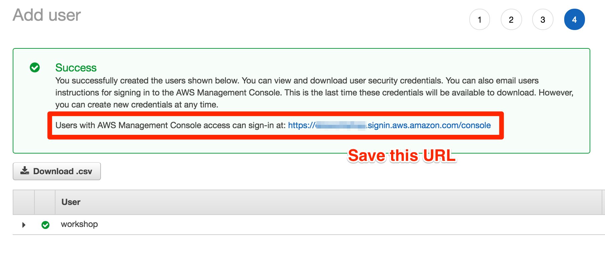

+++
title = "AWS Account"
chapter = false
weight = 31
+++

{}
This section is for people running on their own infrastructure.  If you are running as part of an AWS Event Engine event, you can skip this page.
{}

{}
If you choose to run this workshop on your account, and not part of a hosted workshop, __you are responsible__ for the cost of the AWS services used while running this workshop in your AWS account.
Your account __must__ have the ability to create new IAM roles and scope other IAM permissions.
{}

{}
If you already have an AWS account, and have IAM Administrator access, go to the
[Provision AWS services]() section.
{}

## Create an account 

### Step 1
If you don't already have an AWS account with Administrator access: [create
one now](http://docs.aws.amazon.com/connect/latest/adminguide/gettingstarted.html#sign-up-for-aws)

### Step 2
Once you have an AWS account, ensure you are following the remaining workshop steps
as an **IAM user** with administrator access to the AWS account:
[Create a new IAM user to use for the workshop](https://console.aws.amazon.com/iam/home?region=us-east-1#/users$new)

### Step 3
Enter the user details:

### Step 4
Attach the AdministratorAccess IAM Policy:

### Step 5
Click to create the new user:

### Step 6
Take note of the login URL and save:

## Proceed to Getting Started
TODO: THis line changed to remove relative reference

Once you have completed the step above, you can leave the AWS console open. You can now move to the [**Getting Started**]< relref "20_guided" > section.
