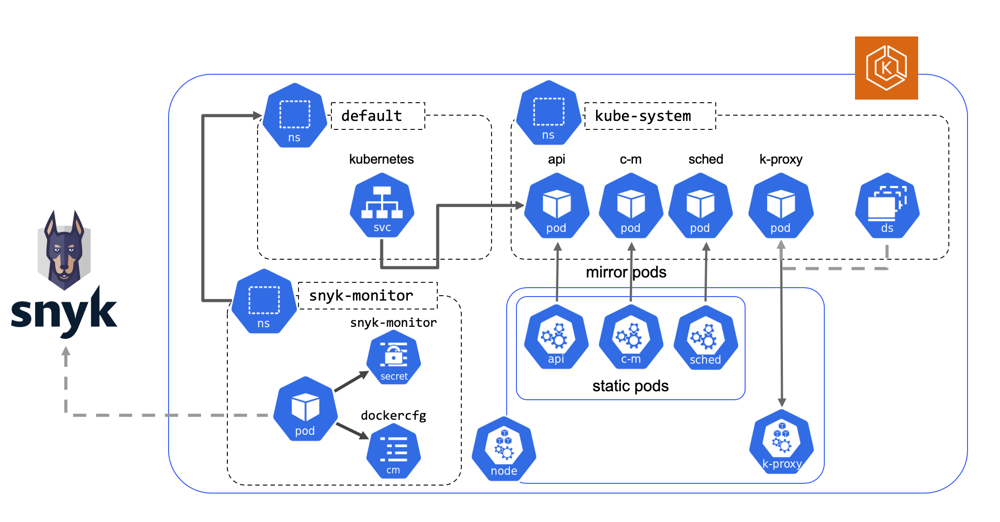

+++
title = "Snyk controller"
chapter = false
weight = 1
+++

Snyk controller for Amazon EKS enables you to import and test your running EKS workloads and identify vulnerabilities in 
their associated images and configurations that might make those workloads less secure. Once imported, Snyk continues to 
monitor those workloads, identifying additional security issues as new images are deployed and the workload configuration changes.

Earlier in the workshop, you deployed Snyk controller to an Amazon EKS cluster. This deployment, setup the following in your
environment:

- Kubernetes namespace for Snyk
- Kubernetes secret containing Skyk integration ID and docker config json.
- Snyk monitor pod

Once deployed to your cluster, you can now easily add additional Kubernetes workloads for monitoring with Snyk.

{} 
A [Helm chart](https://hub.helm.sh/charts/snyk/snyk-monitor) is also available for Snyk monitor.
{}
