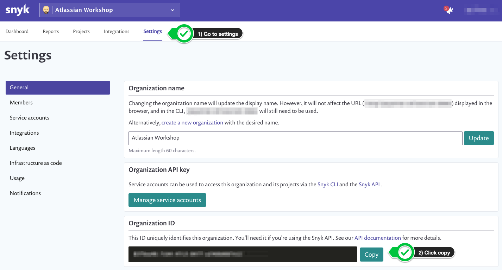
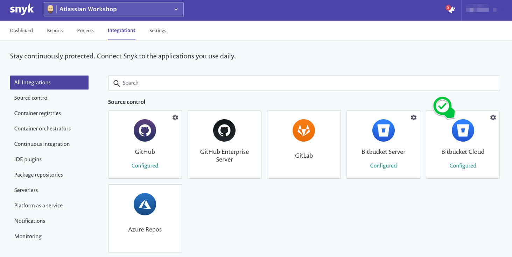
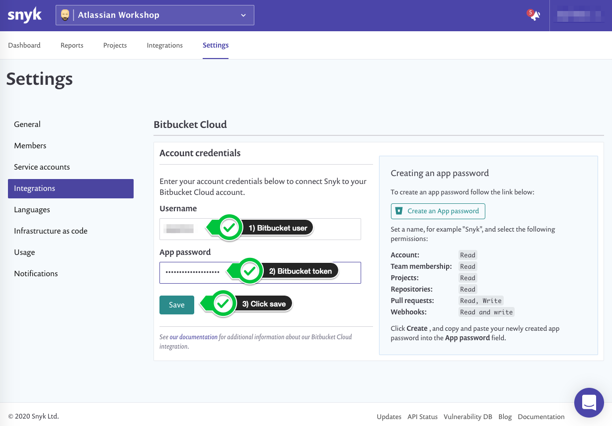
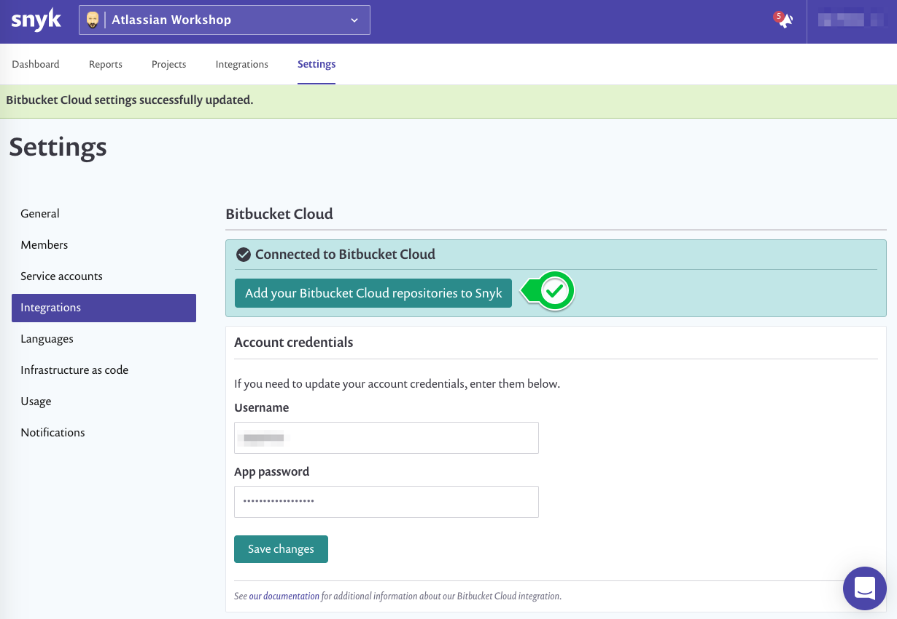
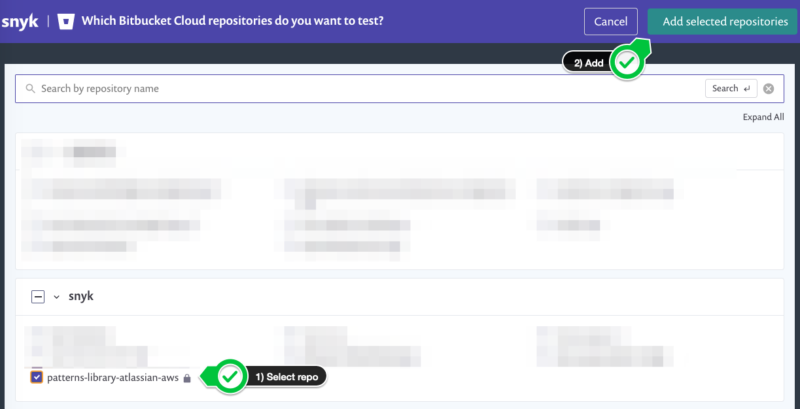

+++
title = "Snyk Configuration"
chapter = false
weight = 2
+++

## Obtain your Snyk API token

From the Snyk console, navigate to __Settings__ and under the __General__ menu `Copy` your __Organization ID__.

TODO: replace this image with new UI

Once you have copied your token, you will need to go back to the Bitbucket Cloud UI and define the `SNYK_TOKEN` __repository variable__.

## Enable Bitbucket integration

From the Snyk console, navigate to __Integrations__ and select __Bitbucket Cloud__.

TODO: replace this image with new UI

From the __Bitbucket Cloud__ integration page, enter your __Bitbucket username__ in the __Username__ field and 
the __Bitbucket app password__ from the previous step in the __App password__ field. Then, click `Save`.

TODO: replace this image with new UI

Once you have successfully connected your Snyk and Bitbucket accounts you will see a confirmation message and the ability to 
__Add your Bitbucket Cloud repository to Snyk__. Click the button to proceed.

TODO: replace this image with new UI

Find the repository you forked in the setup module. Click the checkbox to select it then click the 
__Add selected repository__ button to import your project.

TODO: replace this image with new UI

Let's proceed to the next section.
