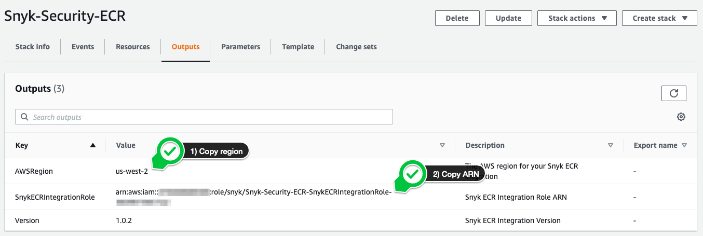
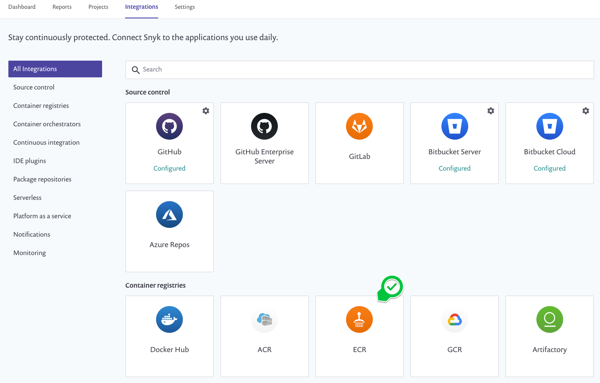
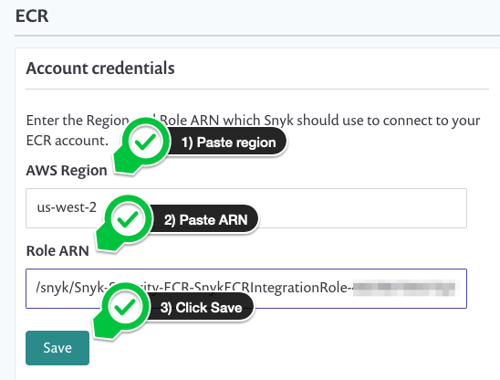
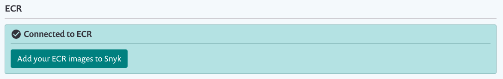
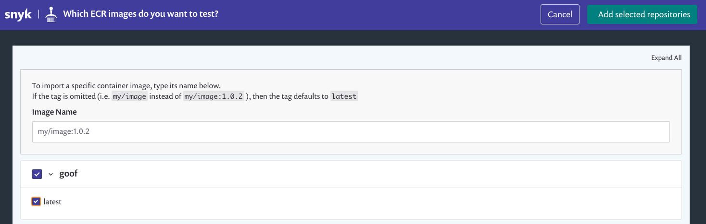

+++
title = "Amazon ECR"
chapter = false
weight = 1
+++

To enable the integration between Amazon ECR and Snyk, we will take advantage of the [**Snyk: Developer-First Security on the AWS Cloud**](https://github.com/aws-quickstart/quickstart-snyk-security) 
__AWS Quick Start__.

{}
Snyk's integration for Amazon Elastic Container Registry (ECR) is enabled between one Amazon ECR registry and one Snyk organization. To 
integrate with multiple registries, create a unique Snyk organization for each registry.
{}

## Obtain your Snyk API token

From the Snyk console, navigate to __Settings__ and under the __General__ menu `Copy` your __Organization ID__.

## Enable the integration

You have the option of establishing cross-account access to enable Snyk's Amazon ECR integration as a 1-click deployment. 
This options is available as an official AWS Quick Start and eliminates the need for manual configuration. By clicking on 
the __Launch Stack__ button below, you will be redirected to the AWS CloudFormation console where you will be prompted to 
complete the following steps:

- Create stack, click **Next**
- Specify stack details, click **Next**
- Configure stack options, click **Next**
- Scroll to bottom section under **Capabilities** and check the box and click **Create stack** 

When you are ready, click the button below!

{}
The installation takes approximately 1 minute to complete.
{}

### Gathering outputs

When complete, the AWS CloudFormation template will provide two necessary values in the __Outputs__ tab. You will copy 
these values.

### Accessing the integrations menu

From the Snyk app, navigate to the __Integrations__ menu then click __ECR__.

### Inputting values

Paste the two values perviously copied from the CloudFormation console's __Outputs__ tab into the respective fields, then click __Save__.

### Adding images

Once successfully connected, you will receive a confirmation message and a button to __Add your ECR images to Snyk__. Click the button.

### Scan repositories

You will be able to browse all repositories associated with the AWS region selected when the integration was enabled. Select the desired
repository, then click the __Add selected repositories__ button.

Let's proceed to the next section.

