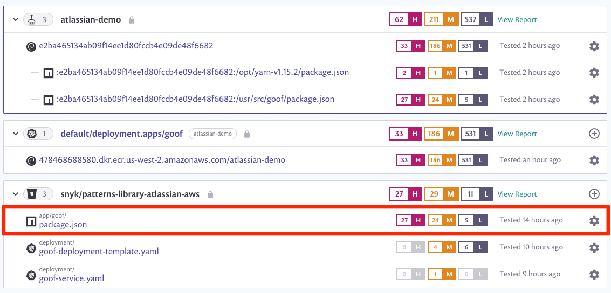
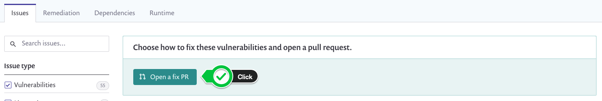
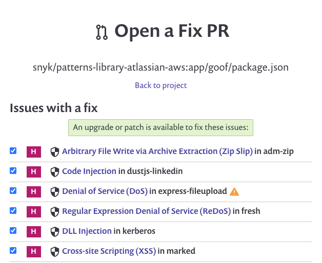
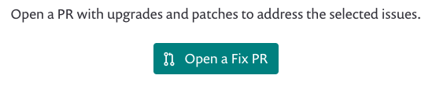
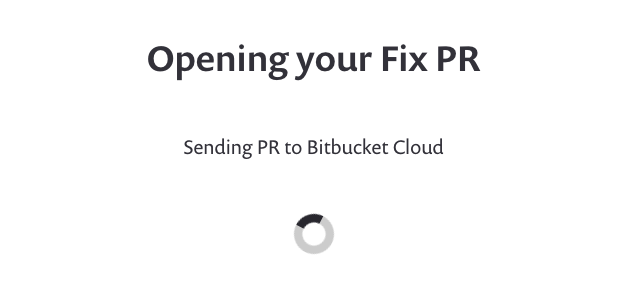

+++
title = "Fix Pull Requests"
chapter = false
weight = 1
+++

From the Snyk app, we will go to the __Projects__ menu where we can expand each integration and have a holistic view of 
our project. Here we will select the `package.json` under our Bitbucket repo.

We are able to view additional context for each identified vulnerability in the report. We also have the option to 
__Open a fix PR__ by clicking on the button. Let's do that!

A summary page will appear listing each fix that will be included in your pull request.

Scroll down to the bottom of the page and confirm the selection by clicking the __Open a Fix PR__ button once again.

Sit back and relax... Snyk is fixing your open source dependency vulnerabilities and making you feel more _secure_. __;-)__

Once complete, you will be redirected to your Bitbucket repo where you can __Approve__ and __Merge__ your __pull request__. 