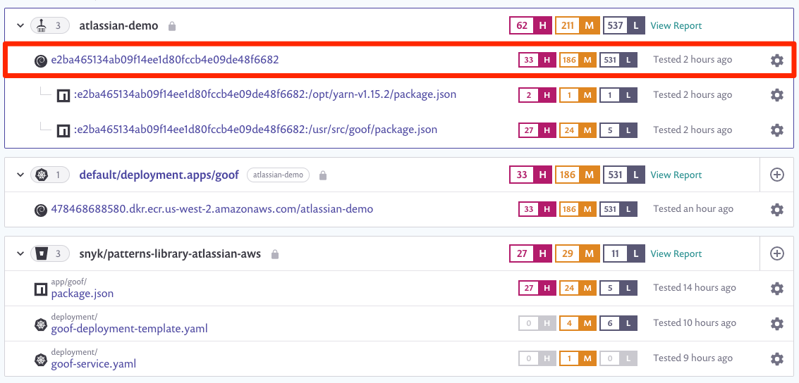
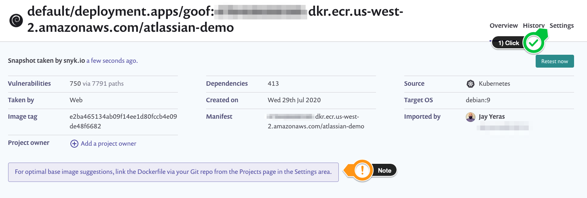
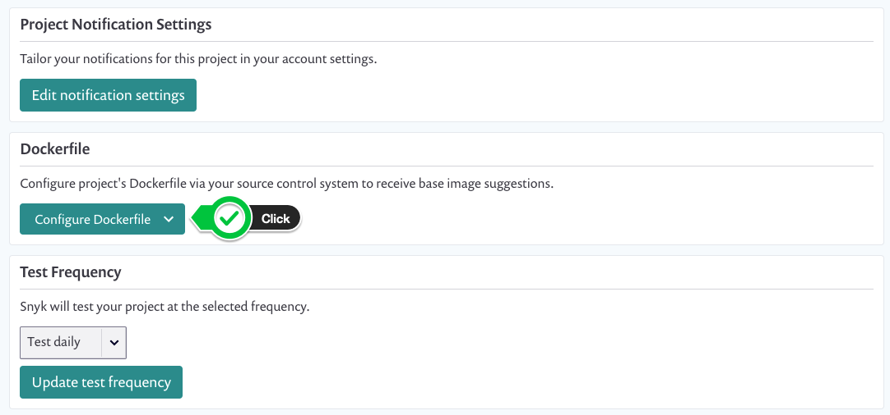
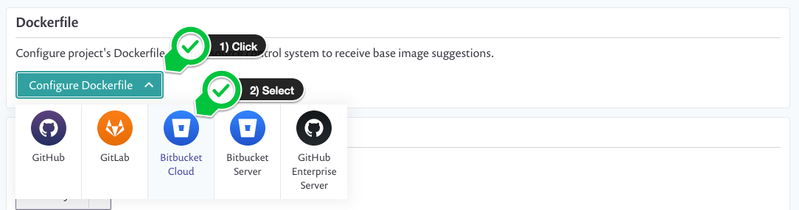
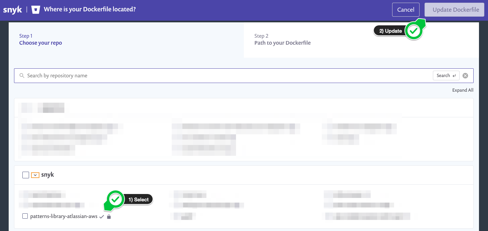
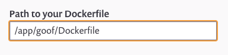
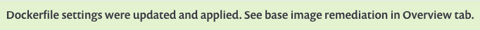
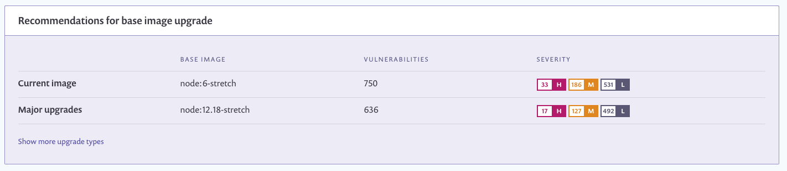
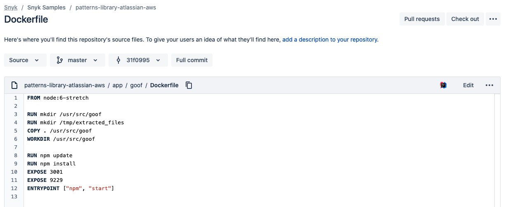

+++
title = "Fix Dockerfile"
chapter = false
weight = 2
+++

From the Snyk app, we will go to the __Projects__ menu where we can expand each integration and have a holistic view of 
our project. Here we will select the ___container image___ under our Amazon ECR repository.

You will notice a message instructing you to complete one minor configuration item. Let's address that by clicking the __Settings__ tab.

Proceed to click on the __Configure Dockerfile__ button.

Select __Bitbucket Cloud__ as your source.

Select your repository and click __Update Dockerfile__.

Update the default path with the path to our Dockerfile. In this case, the path is `/app/goof/Dockerfile` or as shown below:

You will receive a confirmation message stating that the settings have been successfully applied.

Recommendations for base image upgrade will be provided to you. Here, you will notice the __Current image__ defined in your _Dockerfile_ and
a __Major upgrade__ suggestion to reduce the total number of vulnerabilities on your container  image.

For the purpose of this exercise, we will keep things simple and use Bitbucket's built-in editor to make the change. Let's navigate to our _Dockerfile_ in 
our Bitbucket repo. The path will be `./app/goof/Dockerfile`. Here we can _Edit_ the file and save our changes. 

Let's update __Line 1__ as follows:

- __OLD VALUE:__ `node:6-stretch`
- __NEW VALUE:__ `node:12.18-stretch`

Click __Commit__.

