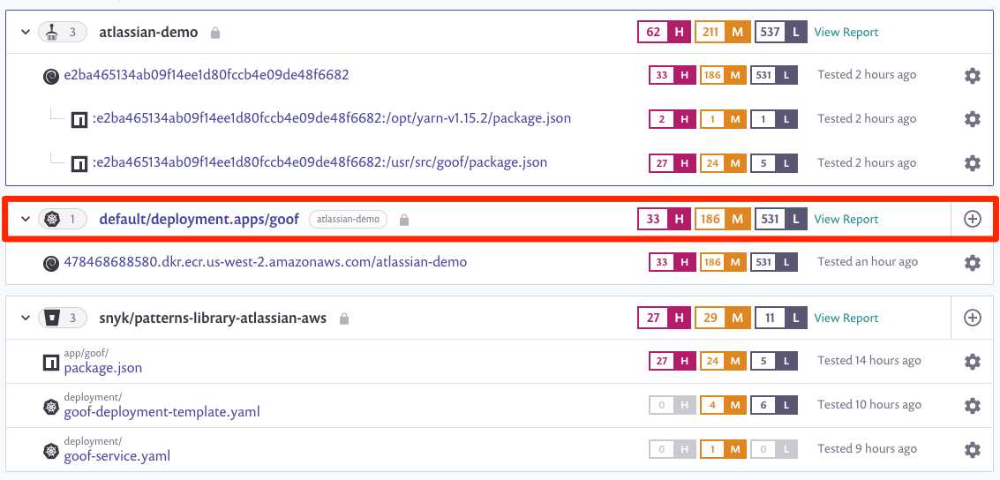
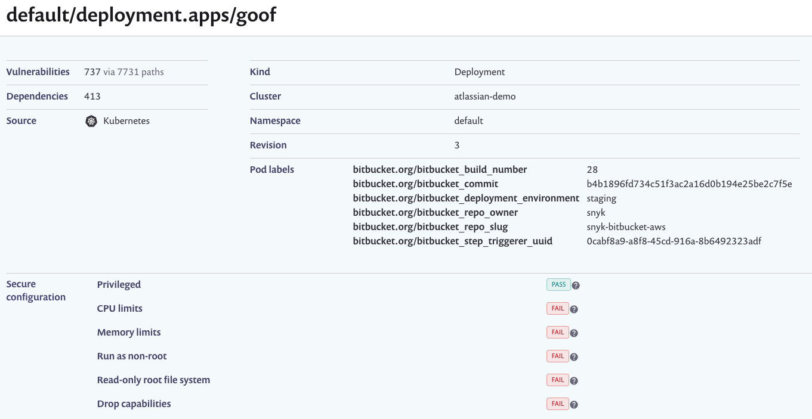
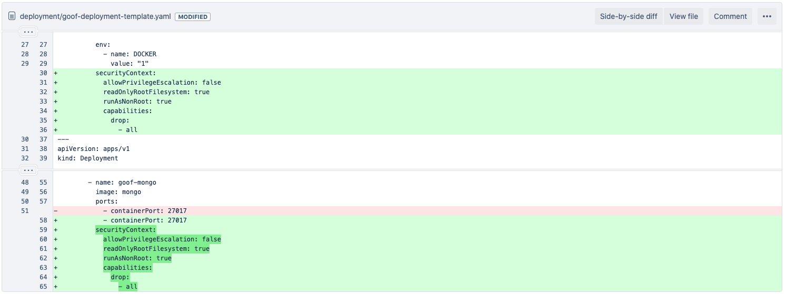

+++
title = "Fix Configuration"
chapter = false
weight = 3
+++

From the Snyk app, we will go to the __Projects__ menu where we can expand each integration and have a holistic view of 
our project. Here we will select the ___Kubernetes deployment___ under our Amazon EKS cluster.



Here we see that our application was deployed to our cluster, however, several _security context_ properties were either 
misconfigured or not configured at all.



If we navigate back to our imported Bitbucket project and review the `goof-deployment-template.yaml` file results, we are
able to see additional context about these issues.


To fix these, we simply add `securityContext` to our manifest and explicitly define these properties. We will copy the following
block into our manifest file.

```yaml
          securityContext:
            allowPrivilegeEscalation: false
            readOnlyRootFilesystem: true
            runAsNonRoot: true
            capabilities:
              drop:
                - all
```

Let's once again, navigate to our Bitbucket repository and edit `./deployment/goof-deployment-template.yaml` with Bitbucket's 
built-in editor so that it looks as follows:



Click __Commit__.