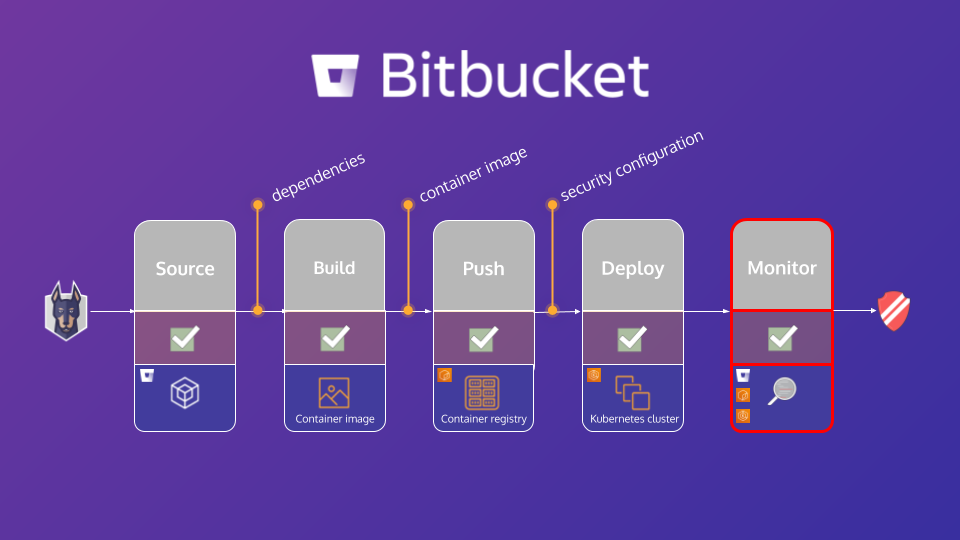

# Module 4 - Fixing known issues & monitoring

## Background

Now it's time to put what we have learned in the previous modules to practice. We will go through three steps that will focus on
fixing issues in your application source, container image, and Kubernetes configuration.

## Learning objective

In this module, you will leverage Snyk to:

1. Submit a __fix pull request__ for the vulnerabilities in your application dependencies
1. Apply __base image upgrade__ recommendations to your container image
1. Define __security context__ in your Kubernetes manifest

## Let's get started!