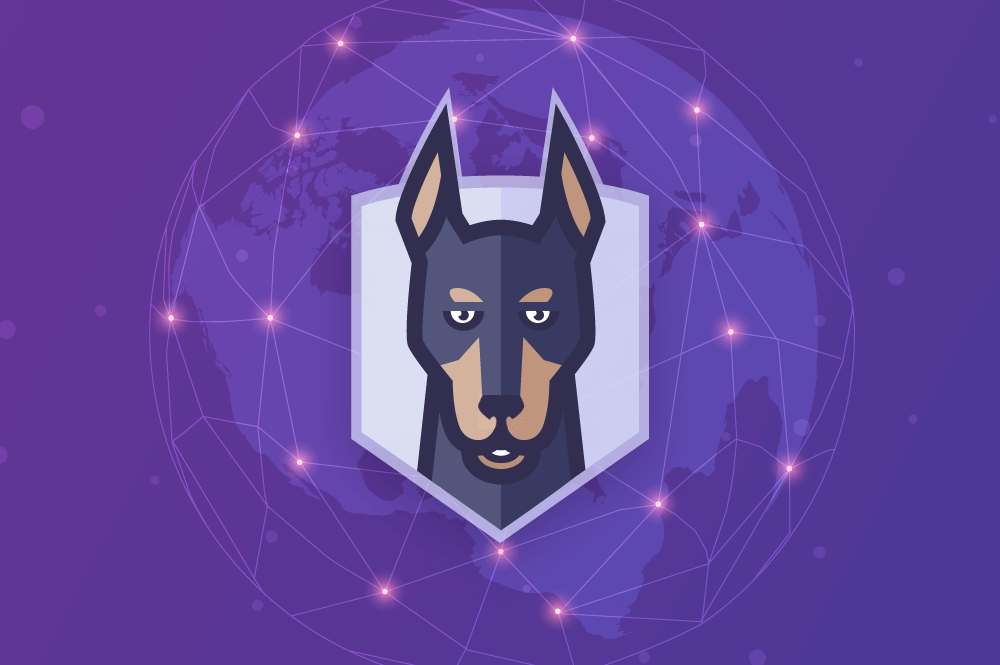

# You did it!

__S__ o __N__ ow __Y__ ou __K__ now that finding potential vulnerabilities in your applications is not something to dread. 
You have the tools at your disposal. You have the _know how_! It's time to take _ownership_ and seamlessly integrate __security__ into your
workflows without compromising efficiency or disrupting your ability to deliver.

On behalf of team Snyk, Atlassian, and AWS... __THANK YOU__ for taking the time to complete this _virtual_ workshop!

## Let's quickly recap what you've learned

1. Integrating Snyk with Bitbucket Cloud
1. Integrating Snyk with Amazon ECR to continuously monitor images
1. Finding and fixing vulnerabilities in open source dependencies in your code
1. Building a secure CI/CD pipeline with Bitbucket Pipelines and Snyk Pipe
1. Scanning container images and applying base image upgrade recommendations
1. Identify and fix insecure configurations in Kubernetes deployments

__Wow!__ That's a lot of knowledge!
