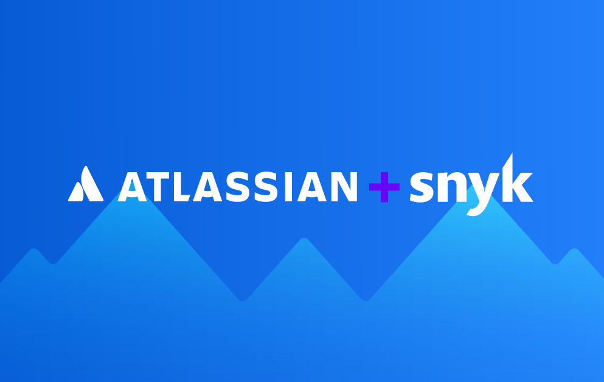

# AWS Modernization Workshop: DevSecOps with Atlassian & Snyk

Join [Snyk](https://snyk.io/) and [Atlassian](https://www.atlassian.com/) for this hands-on virtual workshop where we will guide 
you on implementing security best-practices early on in your workflow to build an automated and secure 
[Continuous Integration (CI)](https://www.atlassian.com/continuous-delivery/continuous-integration) & [Continuous Delivery (CD)](https://www.atlassian.com/continuous-delivery) pipeline.

## Welcome!

In this workshop, you will pose as the newest member of a Mythical 500 company named __Mythical Mysfits__. It's your first day in the office
and your predecessor(s) hastily (i.e. manually) deployed an "enterprise-ready" piece of software for group collaboration: [goof](https://github.com/snyk/goof). 

According to your colleagues, _goof_ became wildly popular as _"The BESTest todo app evar"_. 

However, you are skeptical. Fortunately, your company also recently purchased Snyk and Atlassian Bitbucket Cloud!

In this workshop, you will leverage [Atlassian Bitbucket](https://www.atlassian.com/software/bitbucket), [Bitbucket Pipelines](https://bitbucket.org/product/features/pipelines), 
and [Snyk](https://snyk.io) to build and deploy your application with security.  This includes scanning of your container-based workloads running on 
[Amazon Elastic Kubernetes Service (Amazon EKS)](https://aws.amazon.com/eks/) and [Amazon Elastic Container Registry (ECR)](https://aws.amazon.com/ecr/) 
and how to use these patterns to release features and functionality at a faster pace that includes security at each step.

{}
To make the most effective use of this content, you should be able to run basic Unix commands. You should also possess familiarity with AWS services, basic cloud concepts and general understanding of software development methodologies.
{}